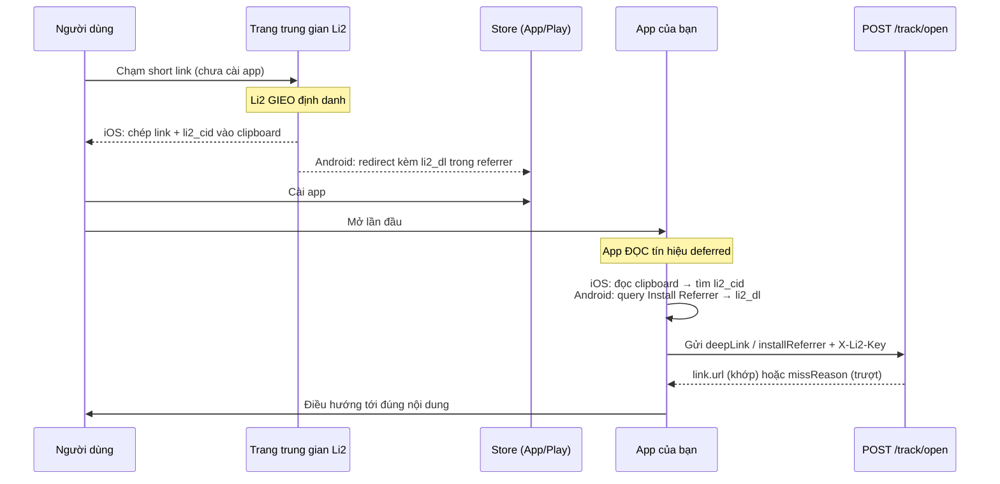

# Tổng Quan Deep Link

<Info>
**Bạn sẽ học**: Deep Link là gì, sự khác nhau giữa hai cơ chế **immediate** và **deferred**, luồng hoạt động end-to-end, và những thứ bạn cần chuẩn bị trước khi tích hợp vào ứng dụng iOS/Android.
</Info>

<Note>
**Beta**: Deep Link Attribution hiện đang ở giai đoạn **Beta** và yêu cầu gói **Pro** để xem phần analytics. Phần cấu hình domain và file xác minh khả dụng cho mọi gói. API và payload mô tả ở đây có thể thay đổi trong các bản cập nhật tới.
</Note>

## Deep Link là gì?

**Deep Link** cho phép một short link hoặc QR code của Li2 **mở thẳng ứng dụng di động** của bạn thay vì mở trình duyệt, khi người dùng đã cài app trên thiết bị. Nếu họ **chưa cài app**, Li2 vẫn ghi nhận lượt chạm để ứng dụng có thể khôi phục đúng nội dung ngay trong lần mở đầu tiên sau khi cài đặt.

Li2 cung cấp **Li2 SDK** chính thức cho iOS (Swift Package, iOS 15+). Với Android hoặc khi cần tùy biến sâu, bạn tích hợp **trực tiếp qua HTTP API** (`POST /api/v1/track/open`).

## Hai cơ chế hoạt động

<CardGroup cols={2}>
  <Card title="Immediate (Đã cài app)" icon="bolt">
    Người dùng đã cài app, chạm vào link → hệ điều hành mở thẳng app qua **Universal Link** (iOS) hoặc **App Link** (Android). App gọi `/track/open` với `deepLink` để ghi nhận và điều hướng.
  </Card>
  <Card title="Deferred (Chưa cài app)" icon="hourglass-half">
    Người dùng chưa cài app, chạm vào link → tải app từ store → lần mở đầu tiên app khôi phục link gốc qua **clipboard** (iOS) hoặc **Google Play Install Referrer** (Android).
  </Card>
</CardGroup>

## Luồng hoạt động end-to-end

<Steps>
  <Step title="Người dùng chạm vào short link trên thiết bị di động">
    Link nằm trên một **custom domain** đã bật Deep Link. Hệ điều hành đọc file `.well-known` của domain để biết app nào được phép xử lý link đó.
  </Step>

  <Step title="Hệ điều hành quyết định mở app hay không">
    - **Đã cài app** → mở thẳng app (Universal Link / App Link). Đây là luồng **immediate**.
    - **Chưa cài app** → hiển thị trang web hoặc chuyển tới App Store / Play Store.
  </Step>

  <Step title="Trường hợp chưa cài: app khôi phục link sau khi cài">
    Trong lần mở đầu tiên, app đọc tín hiệu deferred:
    - **iOS**: đọc clipboard, tìm tham số `li2_cid` trong link đã sao chép.
    - **Android**: gọi Google Play Install Referrer, giải mã tham số `li2_dl`.
  </Step>

  <Step title="App gọi POST /track/open">
    App gửi tín hiệu (`deepLink`, `installReferrer`, hoặc `clipboardStatus`) kèm **publishable key** trong header `X-Li2-Key`. Server đối chiếu và trả về `link.url` đích cùng `matchMethod`.
  </Step>

  <Step title="App điều hướng người dùng tới đúng nội dung">
    Nếu khớp (`link != null`), app mở đúng màn hình. Nếu không khớp (`link == null`), app hiển thị fallback và đọc `missReason` để biết lý do.
  </Step>
</Steps>

## Ba định danh bạn sẽ gặp

Luồng deferred đi qua vài định danh khác nhau — phân biệt rõ để không nhầm khi ghép code:

| Định danh | Xuất hiện ở đâu | Là gì | Ai tạo |
|-----------|-----------------|-------|--------|
| `li2_cid` | Trong link trên **clipboard** (iOS) và bên trong giá trị `li2_dl` (Android) | Token 16 ký tự base62 định danh **cú click gốc**; bằng đúng `visits.li2_cid` để nối lượt cài về click | **Li2** sinh phía server |
| `li2_dl` | Tham số trong **Google Play Install Referrer** (Android) | "Bao" chứa URL đích đã URL-encode (gồm cả `li2_cid`) mà Li2 ghép vào referrer khi chuyển tới Play Store | **Li2** sinh phía server |
| `clickId` | Trường trong **response** `/track/open` | Id của click khi khớp (bằng `li2_cid`), hoặc id ngẫu nhiên khi trượt | Server trả về |

<Info>
**Bạn không tự tạo các định danh này.** Li2 *gieo* chúng ở phía hạ tầng: trang trung gian (chỉ phục vụ khi **chưa cài app**) chép link kèm `li2_cid` vào clipboard, và bản chuyển hướng tới Play Store ghép sẵn `li2_dl` vào referrer. Phía app, bạn chỉ **đọc** rồi gửi nguyên trạng cho `/track/open`.
</Info>

### Luồng deferred — ai gieo, app đọc ở đâu

Sơ đồ dưới đây cố định mental model: định danh được Li2 *gieo* ở bước nào, và app *đọc* nó ở đâu.

## Yêu cầu trước khi tích hợp

<CardGroup cols={2}>
  <Card title="Custom Domain đã xác minh" icon="globe">
    Bắt buộc dùng **domain riêng** đã verify. Subdomain miễn phí `*.li2.link` không dùng được cho Deep Link vì là hạ tầng dùng chung.
  </Card>
  <Card title="Cấu hình App trên Dashboard" icon="gear">
    Đăng ký iOS (Team ID + Bundle ID) và/hoặc Android (package name + SHA-256) để Li2 sinh file xác minh. Xem [Cấu Hình Domain](./domain-setup).
  </Card>
  <Card title="Publishable Key" icon="key">
    Key dạng `li2_pk_...` gửi qua header `X-Li2-Key`. Lấy tại **Settings → Analytics → Publishable Key** trong dashboard (xem [Thiết lập Conversion Tracking](/vi/conversion-tracking/setup) nếu chưa bật Analytics). **Không** dùng server API key (`X-Li2-API-Key`) cho endpoint này.
  </Card>
  <Card title="Gói Pro (cho Analytics)" icon="crown">
    Cấu hình deep link miễn phí, nhưng trang **Deep Link Analytics** yêu cầu gói Pro.
  </Card>
</CardGroup>

## Lộ trình tích hợp

Ba bước, theo đúng thứ tự:

<Steps>
  <Step title="Cấu hình domain & file xác minh">
    Đăng ký app trên dashboard và để Li2 phục vụ `apple-app-site-association` + `assetlinks.json` cho custom domain. → [Cấu Hình Domain](./domain-setup)
  </Step>
  <Step title="Khai báo native & gọi /track/open">
    Thêm Associated Domains (iOS) / intent-filter `autoVerify` (Android), rồi gọi `POST /track/open` cho cả luồng immediate lẫn deferred. → [Tích Hợp iOS & Android](./mobile-integration)
  </Step>
  <Step title="Tra cứu hợp đồng API">
    Đối chiếu request/response, `matchMethod`, `missReason` và mã trạng thái khi cần. → [API: POST /track/open](./track-open-api)
  </Step>
</Steps>

## Bước tiếp theo

<CardGroup cols={2}>
  <Card title="Cấu Hình Domain & File Xác Minh" icon="globe" href="./domain-setup">
    Đăng ký app và để Li2 phục vụ `apple-app-site-association` + `assetlinks.json`.
  </Card>
  <Card title="Tích Hợp iOS & Android" icon="mobile" href="./mobile-integration">
    Các bước cài đặt native cho từng nền tảng, kèm payload mẫu.
  </Card>
  <Card title="API: POST /track/open" icon="code" href="./track-open-api">
    Hợp đồng API đầy đủ: request, response, matchMethod, missReason.
  </Card>
  <Card title="Hướng dẫn cho người dùng" icon="book" href="/vi/guide/deep-links/deep-link-la-gi-li2">
    Góc nhìn marketer: cấu hình và đọc analytics trên dashboard.
  </Card>
</CardGroup>
